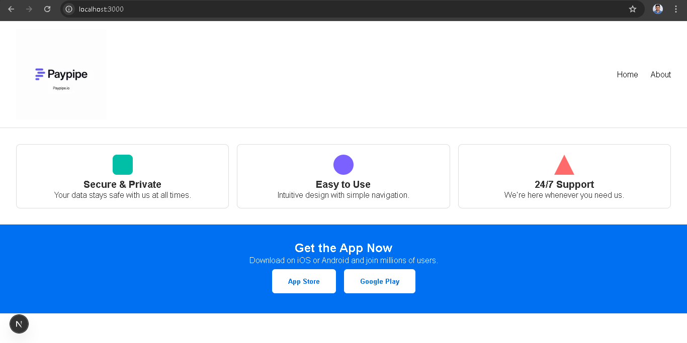

 Trusted App Landing Page

A modern, responsive landing page for a trusted mobile app, 
built using Next.js 14 App Router, React, and CSS Modules.

Project Structure
paypipeland/
├── app/
├── components/
├── data/
├── public/
├── styles/
├── .gitignore
├── next.config.js
├── tsconfig.json
└── README.md

1. Clone the repository:

git clone https://github.com/SURESHGOUD1/frontend.git

2. Install dependencies:

npm install

3.Run the dev server:

npm run dev

 paypipeland@1.0.0 dev
> next dev

   ▲ Next.js 15.4.4
   - Local:        http://localhost:3000
   - Network:      http://192.168.0.250:3000

 ✓ Starting...

1. Initialized Git and Created Initial Commit

git init
git add .
git commit -m "Initial commit: landing page with header and logo"

2. Accidentally Committed node_modules
 noticed GitHub rejected your push because of a file:

python
next-swc.win32-x64-msvc.node is 140.81 MB (exceeds GitHub 100 MB limit)

3. Installed git-filter-repo to Clean History
used git-filter-repo to completely remove node_modules/ and .next/ from the entire Git history:

python -m pip install git-filter-repo
git filter-repo --force --path node_modules/ --invert-paths
git filter-repo --force --path .next/ --invert-paths
 Note: --force was required because the repo wasn’t a fresh clone.

4. Restored Remote and Git Tracking
The filter-repo operation removed the remote, so re-added it:

git remote add origin https://github.com/SURESHGOUD1/frontend.git

5. Added .gitignore for Good Practice
To prevent re-adding large folders like node_modules/ and .next/:

echo node_modules/ >> .gitignore
echo .next/ >> .gitignore
git add .gitignore
git commit -m "Removed node_modules from history and added .gitignore"

6. Force Pushed to GitHub After Cleanup
Since history was rewritten, a force push was required:

git push origin main --force
 
Final Repo Status (Clean!)
No node_modules/ or .next/ in history
.gitignore properly configured
Initial commit with all relevant project files
Repository now under 100MB and GitHub-compatible

